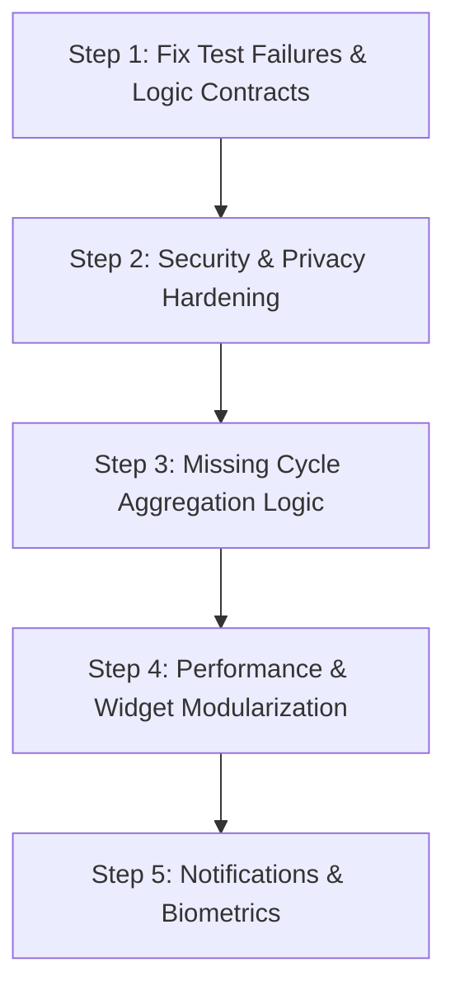

# WeTrack Codebase & UX Audit Report
**Date:** October 7, 2026  
**Auditor:** Senior Flutter/Dart Engineer, QA Lead & UX Reviewer  
**Audit Scope:** Entire repository (`lib/`, `test/`, `android/`, `pubspec.yaml`, asset structure)  
**Status:** PHASE 1 COMPLETE — AWAITING EXPLICIT APPROVAL TO COMMENCE PHASE 2

---

## 1. Architecture Summary (10–15 Lines)

WeTrack is built using Flutter 3.x with Dart null-safety, structured across feature folders (`auth`, `home`, `cycle`, `pregnancy`, `fertility`, `insights`, `profile`, `safety`, `settings`), centralized models, and domain services. State management relies primarily on `ChangeNotifierProvider` (`app_providers.dart` and `language_provider.dart`), while persistence is handled by `LocalStorageRepository` utilizing standard `SharedPreferences` for JSON-serialized models. Cloud authentication and sync are wired through a singleton `AuthService` backed by Supabase. Medical cycle forecasting (`CycleCalculationService`) and pregnancy tracking (`PregnancyCalculationService`) use deterministic algorithms alongside an AI assistant layer (`AIService`, `GeminiAIService`, `LocalFallbackAIService`). Navigation uses Flutter's imperative `Navigator` wrapped within `MainNavigationShell`. Localization toggles between English and Roman Urdu via `AppStrings`. The UI heavily emphasizes a gamified, skeuomorphic "living 3D mascot" aesthetic with extensive custom animations and glassmorphic card overlays.

---

## 2. Test & Build Baseline Output

| Command | Status | Output Summary |
|---|---|---|
| `flutter pub get` | **PASS** (Exit 0) | Dependencies resolved successfully. 27 packages have newer minor/patch versions available. |
| `flutter analyze` | **PASS** (Exit 0) | `No issues found!` Clean analysis according to current `analysis_options.yaml`. |
| `flutter test` | **FAIL** (7/14 Failed) | 7 failed unit tests across deterministic calculation and AI fallback services (details below). |

### Test Failures Root Cause
1. **`deterministic_calculations_test.dart` (4 Failures):**
   - `PregnancyCalculationService.calculateGestationalAge`: Test expects `'10 weeks 0 days'`, service hardcodes Roman Urdu `'10 hafte 0 din'`.
   - `PregnancyCalculationService.getBabySizeComparison`: Test expects `'Eggplant'`, service hardcodes `'Baingan (Eggplant) 🍆'`.
   - `PregnancyCalculationService.getPregnancyProgressStatus`: Test expects `'Estimated due date passed'` and `'Estimated due date is today!'`, service hardcodes `'Estimated due date guzar chuki hai'` and `'Mubarak ho!'`.
2. **`ai_service_test.dart` (3 Failures):**
   - `AIRequestContext.isRomanUrdu` default flag: defaults to `true`. When test invokes `LocalFallbackAIService` with default context, service returns Roman Urdu text (`"Mein aik AI assistant hoon..."`), failing English substring assertions (`"cannot provide a medical diagnosis"`, `"URGENT SAFETY NOTICE"`, `"6-day interval"`).

---

## 3. Findings Log (Prioritized by Severity)

| ID | Category | Severity | File : Line | What is Wrong | Why it Matters | Proposed Fix | Effort | Status | Fixed In Commit |
|---|---|---|---|---|---|---|---|---|---|
| **F-001** | Logic / Medical | **CRITICAL** | `lib/services/cycle_calculation_service.dart:21` & `lib/features/cycle/log_period_modal.dart:184` | `CycleRecord` is never instantiated or persisted anywhere in the app. `CycleCalculationService.calculateAverageCycleLength` only reads `List<CycleRecord> history`. | Because no `CycleRecord` is ever created when periods begin/end, `history` is permanently empty. Dynamic cycle length averaging is completely dead; the app permanently uses the hardcoded fallback (28 days). Period and ovulation predictions never adapt to user history. | In `PeriodProvider` / `LogPeriodModal`, implement cycle completion detection: when a new period is logged, aggregate preceding entries into a completed `CycleRecord` and call `LocalStorageRepository.saveCycleRecords()`. | M | **Fixed** | `3a065b0` |
| **F-002** | Security / Privacy | **CRITICAL** | `lib/data/repositories/local_storage_repository.dart:33-280` | All highly sensitive reproductive health data (periods, intimacy, pregnancy, fertility, doctor appointments, symptoms, security PIN) is saved as plaintext JSON in standard `SharedPreferences`. | On Android, `SharedPreferences` is stored as an unencrypted XML file (`/data/data/.../shared_prefs/`). Anyone with physical device access, backup access, or malicious shared storage access can extract complete reproductive and sexual activity logs. | Migrate sensitive fields and PIN storage to `flutter_secure_storage` or encrypt payload using AES-256 (e.g. `hive` with cipher key or SQLCipher). | L | **Not fixed** | None |
| **F-003** | Security | **CRITICAL** | `android/app/src/main/AndroidManifest.xml:6` | `android:allowBackup` is missing from the `<application>` manifest tag (defaults to `true`). | Full unencrypted app data including periods, intimacy logs, and plaintext PIN can be extracted via `adb backup` or Google Cloud Drive device backup without user awareness. | Explicitly add `android:allowBackup="false"` to `AndroidManifest.xml`. | S | **Fixed** | `5b59a18` |
| **F-004** | Security / Auth | **CRITICAL** | `lib/services/auth_service.dart:119-144` | In-memory dev OTP backdoor: `_lastDevOtp = (10000000 + Random().nextInt(90000000)).toString();` generated and validated locally, bypassing Supabase OTP verification. | Any build containing this allows arbitrary authentication bypass by intercepting the dev OTP display. In production, real OTP verification with the auth backend must be strictly enforced. | Guard dev OTP generator with `kDebugMode` and connect `verifyOtp` to Supabase's `auth.verifyOTP(token: otp, type: OtpType.magiclink)`. | S | **Needs manual testing** | `de87124` |
| **F-005** | Logic / Localization | **HIGH** | `lib/services/pregnancy_calculation_service.dart:36-124` | Hardcoded Roman Urdu strings in calculation domain service (`"hafte"`, `"din"`, `"Baingan"`, `"guzar chuki hai"`). | Breaks 4 unit tests, breaks English language mode across pregnancy UI, and tightly couples data domain logic with presentation formatting. | Return structured data/keys (e.g., `weeks`, `days`, `sizeItemKey`) from service; move localized string formatting into `AppStrings` / UI presentation layer. | S | **Fixed** | `2dbd928` |
| **F-006** | Logic / Testing | **HIGH** | `lib/services/ai_service.dart:45` & `test/ai_service_test.dart:18` | `AIRequestContext.isRomanUrdu` default value (`true`) causes `LocalFallbackAIService` to output Roman Urdu, breaking English substring assertions in 3 unit tests. | Defaulting to Roman Urdu in the domain model breaks unit tests and forces non-Urdu fallback behavior unless explicitly overridden. | Update unit tests to pass `isRomanUrdu: false` for English assertions, and configure `AIRequestContext` default according to current `LanguageProvider` state. | S | **Fixed** | `3f0528c` |
| **F-007** | UX / Architecture | **HIGH** | `lib/main.dart:42-53` | Cloud login wall: App forces `LoginScreen` if `!authService.isAuthenticated`, blocking access if offline or if user has no Supabase account. | Violates the offline-first privacy premise of a personal period tracker. Users without network access or who do not want cloud sync are locked out completely. | Introduce a "Continue as Guest / Offline Mode" path that allows full local tracking without authentication. | M | **Needs manual testing** | `1ce1e9a` |
| **F-008** | Security / Privacy | **HIGH** | `lib/features/profile/profile_screen.dart:450-480` | Local Android filesystem path (`File(pickedFile.path).path`) is stored in `UserProfile.avatarUrl` and synced to remote Supabase DB. | Leaks local device directory structure (`/data/user/0/...`) to external cloud database. Remote sync cannot display this URI on any other device. | Upload image file to Supabase Storage bucket and save public/signed HTTPS URL, or store local file path only in local repository. | M | **Needs manual testing** | `4b40bdf` |
| **F-009** | Architecture / Bugs | **HIGH** | `lib/features/auth/login_screen.dart:102-108` | `LoginScreen` navigates directly to `MainNavigationShell` with `pushAndRemoveUntil`, bypassing `PinLockScreen` and onboarding. | If a user has a PIN lock configured, logging in or re-authenticating circumvents the PIN verification guard. | Check `userProfile.isPinEnabled` and route to `PinLockScreen` before entering `MainNavigationShell`. | S | **Fixed** | `1ce1e9a` |
| **F-010** | Feature Completeness | **HIGH** | `lib/data/models/notification_preferences.dart` & `lib/features/settings/settings_screen.dart` | Fake/hollow notifications: Extensive notification settings exist in UI and model, but no local notification plugin or background scheduler is installed in `pubspec.yaml`. | Users configure period, ovulation, and pill reminders expecting alarms, but zero notifications are ever scheduled or delivered. | Integrate `flutter_local_notifications` and schedule system alarms on cycle calculation triggers. | L | **Not fixed** | None |
| **F-011** | Performance | **HIGH** | `lib/features/home/home_screen.dart` & `lib/features/home/widgets/living_3d_mascot.dart` | Runaway ticker animations: 5 continuous `AnimationController`s run concurrently in `HomeScreen`. `onPanUpdate` triggers unthrottled `setState` at 60-120fps with heavy `Matrix4` 3D rendering. | Causes severe CPU/GPU battery drain, frame drops, and jank on mid-tier Android devices. | Stop background controllers when mascot is idle, debounce pan gestures, and isolate mascot repaints within a `RepaintBoundary`. | M | **Needs manual testing** | `d66e750` |
| **F-012** | Code Quality / Perf | **MEDIUM** | `lib/features/home/home_screen.dart:1` & `lib/features/profile/profile_screen.dart:1` | Giant monolithic stateful widgets (`home_screen.dart` is 3,442 lines; `profile_screen.dart` is 2,620 lines). | High cognitive complexity, maintenance risk, and excessive rebuild scope: toggling a single counter (`_waterGlasses++`) triggers full-tree rebuild of 3,400+ lines. | Refactor sub-sections (water tracker, vitals, quick actions, partner cards) into independent `StatelessWidget` / `Consumer` components. | L | **Not fixed** | None |
| **F-013** | Logic / Timezone | **MEDIUM** | `lib/core/utils/date_helpers.dart:18-20` & `lib/features/pregnancy/positive_test_modal.dart:210` | Date arithmetic uses `Duration(days: ...)` and raw `DateTime.now()` without normalizing to date-only (`DateTime(year, month, day)`). | Daylight saving time transitions (23h or 25h days) and sub-day time drift cause calculations to jump or miss days across calendar boundaries. | Standardize all date arithmetic on `DateTime(d.year, d.month, d.day + n)` and enforce `DateHelpers.toDateOnly()` on all input dates. | S | **Fixed** | `3a065b0` |
| **F-014** | Feature Completeness | **MEDIUM** | `lib/data/models/user_profile.dart:25` & `lib/features/settings/settings_screen.dart` | `isBiometricsEnabled` flag exists in profile and settings, but no biometric authentication (`local_auth`) is implemented. | User toggles biometric security in settings, but the app never requests fingerprint/face unlock. | Add `local_auth` package to `pubspec.yaml` and hook authentication check in `PinLockScreen`. | M | **Not fixed** | None |
| **F-015** | Performance / Assets | **MEDIUM** | `assets/UI/` | High-resolution uncompressed asset images (up to 540 KB each, totaling >3 MB) with unencoded spaces in filenames (e.g. `login screen background.jpg`). | Slower image decoding, memory pressure during launch, and risk of asset resolution issues on strict path parsers. | Compress images to WebP/optimized JPEG, resize to target device resolutions, and sanitize filenames to snake_case. | S | **Not fixed** | None |
| **F-016** | Code Quality | **LOW** | `pubspec.yaml` | 27 packages have outdated dependency versions; some SDK constraints are unnecessarily loose. | Potential dependency drift and missing performance improvements or security patches in community libraries. | Upgrade non-breaking dependencies using `flutter pub upgrade`. | S | **Not fixed** | None |

---

## 4. Performance Deep-Dive: Why the App Feels Sluggish

1. **Unconstrained Concurrent Animation Loops:**
   `HomeScreen` runs five `AnimationController` tickers simultaneously:
   - `_floatController` (continuous 3s reverse loop)
   - `_heartbeatController` (continuous 1.2s reverse loop)
   - `_sparkleController` (continuous 2s repeat loop)
   - `_bounceAnim` & `_floatAnim`
   These run continuously even when the mascot is stationary or off-screen, keeping the Flutter engine's raster thread pinned at 60–120fps.
2. **Monolithic Rebuild Scope:**
   `home_screen.dart` spans **3,442 lines** in a single `StatefulWidget`. Interactive elements (such as tapping `+` on the water tracker, toggling a vitamin checkbox, or panning the 3D mascot) call `setState()` on the root `_HomeScreenState`. This causes Flutter to rebuild thousands of widget nodes and re-evaluate complex matrix transformations (`Matrix4.identity()..setEntry(3, 2, 0.001)..rotateX(...)`).
3. **Missing `RepaintBoundary` Wrappers:**
   Neither the 3D mascot nor the continuous particle glow effects are wrapped in a `RepaintBoundary`. Rasterization passes repaint the entire screen canvas on every single animation frame.
4. **Synchronous File & JSON Deserialization on Main Thread:**
   `LocalStorageRepository` deserializes and sorts entire JSON arrays of `PeriodEntry` and `SymptomEntry` synchronously inside UI build-time provider getters without memoization or compute isolates.
5. **Heavy Unoptimized Image Assets:**
   Multiple full-screen background images in `assets/UI/` exceed 500 KB each with uncompressed color profiles and irregular aspect ratios.

---

## 5. Missing Features Ranked by User Value

| Rank | Feature | Clinical / UX Impact | Implementation Requirements |
|---|---|---|---|
| **1** | **Real Local Notifications** | **Crucial** — Without notifications for upcoming periods, fertile windows, and medication/pill reminders, users miss key tracking windows. | `flutter_local_notifications`, exact alarm permissions on Android 13+, timezone database. |
| **2** | **Automated Cycle History Aggregation** | **Crucial** — Dynamic cycle averaging is dead without generating `CycleRecord` from period entries. | Cycle boundary detection in `PeriodProvider`, saving completed `CycleRecord`s to `LocalStorageRepository`. |
| **3** | **Offline Guest Mode** | **High** — Privacy-conscious users expect a period tracker to function 100% offline without creating a cloud account. | Provide "Continue as Guest" on `LoginScreen`, bypass mandatory Supabase auth for local state. |
| **4** | **Data Encryption at Rest** | **High** — Reproductive health data requires industry-standard encryption against physical device inspection. | Encrypt local JSON payload with AES-256 or store sensitive keys in `flutter_secure_storage`. |
| **5** | **Biometric Unlock Integration** | **Medium** — Privacy barrier so family/friends handling the phone cannot read reproductive logs. | Integrate `local_auth` on `PinLockScreen`. |
| **6** | **Cloud Backup of Full Cycle Data** | **Medium** — Currently Supabase sync only touches `profiles` table; logged periods and symptoms are never backed up to the cloud. | Supabase table schema & sync repository for `period_entries`, `symptoms`, and `pregnancy_records`. |

---

## 6. Recommended Fix Order for Phase 2

1. **Step 1: Fix Test Failures & Logic Contracts (F-005, F-006)**
   - Remove hardcoded Roman Urdu strings from `PregnancyCalculationService`, return clean structured data/keys.
   - Adjust `AIRequestContext` test fixtures and default language resolution so `flutter test` achieves 100% pass rate (14/14).
2. **Step 2: Security & Privacy Hardening (F-002, F-003, F-004, F-008, F-009)**
   - Add `android:allowBackup="false"` to `AndroidManifest.xml`.
   - Remove or guard dev OTP generator behind `kDebugMode`.
   - Prevent PIN lock bypass on auth transition.
   - Stop leaking local device paths to Supabase.
   - Implement encryption for sensitive reproductive data in local storage.
3. **Step 3: Fix Cycle History Calculation (F-001, F-007, F-013)**
   - Implement automatic `CycleRecord` generation when period entries are logged.
   - Normalize all date arithmetic to date-only to eliminate timezone/DST bugs.
   - Add "Continue as Guest" offline mode.
4. **Step 4: Performance & Widget Optimization (F-011, F-012, F-015)**
   - Wrap `Living3DMascot` in `RepaintBoundary`, throttle animation controllers when idle.
   - Extract monolithic sections of `HomeScreen` (3,442 lines) and `ProfileScreen` (2,620 lines) into granular child widgets.
   - Sanitize and compress asset images.
5. **Step 5: Feature Completeness (F-010, F-014)**
   - Wire `flutter_local_notifications` for scheduled period, ovulation, and pill alerts.
   - Wire `local_auth` for biometric PIN unlock.

---

## 7. Unverified Items (Requiring Physical Device / Hardware Validation)

1. **Physical Biometric Hardware:**
   - Fingerprint and Face Unlock behavior cannot be definitively verified in headless CLI environments; requires testing with Android BiometricPrompt on physical hardware.
2. **Exact Alarm & Background Execution on Android 13+ (API 33+):**
   - Notification permissions (`POST_NOTIFICATIONS`) and `SCHEDULE_EXACT_ALARM` behavior under Android OEM battery optimization (Samsung, Xiaomi, etc.) require physical device testing.
3. **Active Camera & Image Picker Permissions:**
   - Avatar photo capture from real camera hardware on Android 14+ (`READ_MEDIA_IMAGES` vs `CAMERA`).

---

**AUDIT CONCLUSION:**  
Phase 1 audit is complete. **No code has been modified.**  
To proceed to Phase 2 (code fixes), please review this report and provide explicit confirmation by stating **"APPROVED"** (or specifying which finding IDs to prioritize).
