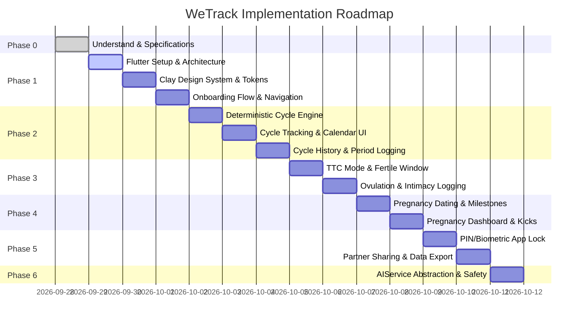

# WeTrack — Practical Implementation Plan

> **App:** WeTrack (Private Fertility & Pregnancy Companion)  
> **Tech Stack:** Flutter 3.x / Dart, Riverpod, Offline-first local storage, Clean Architecture  
> **Design Foundation:** Tactile Clay Pastel (from Google Stitch "Feminine Health Journey App UI")

---

## Roadmap Overview

---

## Phase 0: Understand & Requirements Alignment (Complete)
- [x] Read and analyze all seven specification PDFs:
  - `01_PRODUCT_BRIEF.pdf`
  - `02_UX_FLOW_AND_SCREENS.pdf`
  - `03_MEDICAL_SAFETY_KNOWLEDGE.pdf`
  - `04_CALCULATIONS_AND_DATA_RULES.pdf`
  - `05_AI_ASSISTANT_SPEC.pdf`
  - `06_FLUTTER_ARCHITECTURE_AND_SECURITY.pdf`
  - `07_BUILD_ROADMAP_AND_ACCEPTANCE.pdf`
- [x] Inspect `/UI` reference gallery images (`Pastel clay-style app login screen.jpg`, `Period Tracker.jpg`, `Pregnancy & Period Tracker Mobile App...`, `download.jpg`).
- [x] Inspect Google Stitch project `"Feminine Health Journey App UI"` (`projects/17944869357226950732`).
- [x] Produce [docs/UNDERSTANDING.md](file:///d:/Development/WeTrack/docs/UNDERSTANDING.md) and [docs/ASSUMPTIONS.md](file:///d:/Development/WeTrack/docs/ASSUMPTIONS.md).
- [x] Produce this [docs/IMPLEMENTATION_PLAN.md](file:///d:/Development/WeTrack/docs/IMPLEMENTATION_PLAN.md).

---

## Phase 1: Foundation, Architecture & Clay Design System
### Objectives:
Establish the Flutter mobile application structure, clean architecture boundaries, design tokens, claymorphic UI kit, bottom navigation shell, and onboarding flow.

### Tasks:
1. **Initialize Project & Structure:**
   - Create Flutter application `we_track` in the repository or configure the root project.
   - Set up folder structure:
     - `lib/core/` (constants, theme, utils, date helpers, security)
     - `lib/data/` (models, local storage, repositories)
     - `lib/features/` (onboarding, cycle, fertility, pregnancy, appointments, education, partner, ai, settings)
   - Configure dependencies (`flutter_riverpod`, `shared_preferences`, `intl`, `uuid`, etc.).
2. **Tactile Clay Pastel Design System:**
   - Define `ClayColors`:
     - Canvas: `#FAF8F5`
     - Card Surface: `#FFFFFF`
     - Lavender Primary: `#8B5CF6`, `#A78BFA`, `#EDE9FE`
     - Blush Rose: `#F472B6`, `#FDA4AF`, `#FFF1F2`
     - Mint Clay: `#6EE7B7`, `#ECFDF5`
     - Sunny Pastel: `#FDE68A`, `#FEF9C3`
     - Text Primary: `#2E1065`
     - Text Muted: `#6B7280`
   - Define `ClayTheme` and text styles using *Plus Jakarta Sans*.
   - Create reusable Claymorphic widgets:
     - `ClayCard` (dual-shadow diffusion, soft white specular highlight, 28px radius).
     - `ClayButton` (pill-shaped CTA with pressed indentation).
     - `ClayPill` / `ClayChip` (selectable symptom & mood tags).
     - `ClayTextField` (inset embossed groove input).
3. **Navigation Shell:**
   - Main scaffold with 5 tabs: **Home**, **Calendar**, **Insights**, **Learn**, **Settings**.
   - Floating Action Button for quick logging.
4. **Onboarding Flow:**
   - Step 1: Welcome & privacy commitment (local storage, no ads, no trackers).
   - Step 2: Name / profile setup.
   - Step 3: Last period date picker.
   - Step 4: Typical cycle length & period duration sliders.
   - Step 5: Goal selection (*Track Cycle*, *Try to Conceive*, *Already Pregnant*).
   - Local persistence of initial profile.

---

## Phase 2: Deterministic Cycle Tracking & Calendar
### Objectives:
Implement the core mathematical cycle calculation engine with full test coverage, radial cycle wheel, period log modal, and monthly calendar.

### Tasks:
1. **Deterministic Calculation Services (`CycleCalculationService`):**
   - Cycle length calculation between consecutive period start dates.
   - Dynamic average cycle calculation from historical records (excluding outliers/anomalies).
   - Ovulation day estimate ($\text{Cycle Length} - 14 \text{ days}$).
   - 6-day fertile window estimate ($[\text{Ovulation} - 5, \text{Ovulation}]$).
   - Cycle day index calculation ($(\text{Current Date} - \text{Start Date}) + 1$).
2. **Automated Unit Tests:**
   - Test regular cycles (28 days, 30 days).
   - Test short (21 days) and long (35+ days) cycles.
   - Test leap year and month boundary transitions.
   - Test variable cycle histories and fallback defaults.
3. **Cycle Dashboard UI (Home - Cycle Mode):**
   - Prominent radial cycle wheel (Menstrual, Follicular, Ovulation, Luteal phase coils).
   - Cycle day indicator (`Day 14`), days until next period (`Expected in 14 days`).
   - Quick log action buttons (Flow, Symptoms, Moods).
   - Daily status cards with clinical estimation badges.
4. **Interactive Calendar Screen:**
   - Month view with color-coded dot and background indicators.
   - Distinction between user-confirmed period days (solid rose) and predicted future period days (dashed/tinted rose).
   - Fertile window highlight (sunny pastel) and estimated ovulation marker.
   - Clear calendar legend.
5. **Cycle History & Insights Screen:**
   - Past cycle logs list, cycle duration bar charts, and symptom frequency breakdown.

---

## Phase 3: Trying-to-Conceive (TTC) Mode
### Objectives:
Deliver the fertility and conception optimization suite with strict medical safety language and privacy controls.

### Tasks:
1. **TTC Dashboard & Mode Switcher:**
   - Estimated fertile window countdown and daily conception probability indicator (*Low*, *Medium*, *Peak*).
   - Mandatory medical uncertainty banner: *"Fertile window is estimated based on statistical models. Ovulation timing naturally varies."*
2. **Fertility Logging:**
   - Ovulation predictor kit (OPK / LH test) recording: *Negative*, *Positive*, *Not Tested*.
   - Cervical mucus consistency logging (*Egg white*, *Watery*, *Creamy*, *Sticky*, *Dry*).
   - Basal Body Temperature (BBT) recording and trend graph.
   - Intimacy logging (strictly private by default, hidden from shared views).
3. **ASRM Guidance & Infertility Escalation:**
   - Educational prompt for regular intercourse every 1–2 days during fertile window without rigid scheduling.
   - Neutral clinical assessment reminder based on user age and duration trying:
     - Female $< 35$: prompt after 12 months.
     - Female $\ge 35$: prompt after 6 months.
   - Daily 400 mcg folic acid general education card.

---

## Phase 4: Pregnancy Journey & Due Date Calculator
### Objectives:
Provide week-by-week gestational tracking, fetal milestone comparisons, prenatal appointment manager, and emergency red-flag safety guidance.

### Tasks:
1. **Positive Pregnancy Test Flow:**
   - Seamless transition from Cycle or TTC mode into Pregnancy mode without re-entering last period date.
   - Option to enter ultrasound/clinician-confirmed due date or compute via LMP (280-day Naegele model).
2. **Pregnancy Dashboard UI (Home - Pregnancy Mode):**
   - Gestational age banner: `X weeks Y days`.
   - Trimester indicator (1st, 2nd, 3rd) and progress bar.
   - Estimated Due Date (EDD) and countdown (`X days to estimated arrival`, handling post-term safely).
   - 3D Clay baby milestone card (e.g., Week 16 Avocado, Week 20 Banana, etc.).
3. **Prenatal Appointments & Symptom Journal:**
   - Add/edit prenatal appointments with doctor name, clinic, notes, and local reminders.
   - Pregnancy-specific symptom logging (nausea, fatigue, kicks, Braxton Hicks).
   - Kick counter utility.
4. **Emergency Red-Flag Guidance:**
   - Non-alarmist red-flag safety modal for severe symptoms (e.g., heavy bleeding, severe cramping, sudden swelling/vision changes).
   - Emergency clinician contact quick dial.

---

## Phase 5: Privacy, Security & Partner Sharing
### Objectives:
Implement local app lock, zero-knowledge partner sharing controls, and data sovereignty tools.

### Tasks:
1. **App Lock:**
   - 4-digit PIN setup, verification, and reset flow.
   - Local biometric authentication (Fingerprint / Face ID).
   - Auto-lock on app backgrounding/timeout.
2. **Partner Sharing System:**
   - Secure pairing code generation.
   - Granular, field-level toggle permissions:
     - Share cycle phase / period start: *Yes/No*
     - Share pregnancy week & milestones: *Yes/No*
     - Share appointments: *Yes/No*
     - Share intimate logs / sexual activity: *Always Disabled by default*
     - Share personal notes: *Always Disabled by default*
   - Immediate one-tap revoke option.
3. **Data Management:**
   - Backup/Export user records to local JSON file.
   - Permanent "Delete All Data" option with confirmation modal.

---

## Phase 6: AI Assistant (Decoupled & Safety-Grounded)
### Objectives:
Implement an optional conversational explanation assistant with strict medical safety guardrails and offline fallback.

### Tasks:
1. **`AIService` Interface & Provider Abstraction:**
   - Contract: `Future<AIResponse> askAssistant({required AIContext context, required String question})`.
   - Local rules-based / FAQ fallback provider (works 100% offline).
   - Gemini API adapter (configurable via secure runtime environment variable).
2. **Safety Prompt & Grounding:**
   - System instructions strictly forbidding diagnosis, medication changes, or contraceptive guarantees.
   - Context injection strictly restricted to current mode, cycle day / gestational week, and user's specific question.
   - Clinical disclaimer on all AI responses.

---

## Verification & Acceptance Criteria
- [ ] `flutter analyze` runs with zero warnings or errors.
- [ ] Automated unit test suite passes with 100% coverage on date, cycle, and pregnancy calculations.
- [ ] App launches and operates completely offline with no network connectivity required.
- [ ] UI visual fidelity matches the Stitch "Tactile Clay Pastel" design system (colors, clay bevels, Plus Jakarta Sans typography, pill buttons).
- [ ] All medical estimates display explicit uncertainty labels.
