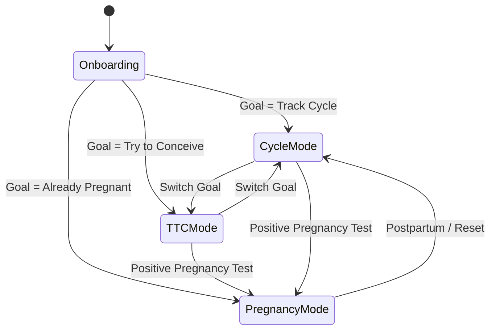

# WeTrack — Product Understanding Document

> **App Name:** WeTrack  
> **Type:** Private Fertility & Pregnancy Companion for Women and Couples  
> **Platform:** Flutter Mobile (Android-First), Clean Architecture, Offline-First MVP  
> **UI Aesthetic:** Tactile Clay Pastel (from Google Stitch "Feminine Health Journey App UI" & `/UI` reference gallery)

---

## 1. Product Summary & Vision
WeTrack is a private, calm, and clinically safe mobile companion designed to guide women and couples across their reproductive health journey:
$$\text{Cycle Tracking} \longrightarrow \text{Trying to Conceive (TTC)} \longrightarrow \text{Pregnancy Tracking}$$

* **Core Positioning:** Tracking, education, and thoughtful reminders — **not** a clinical diagnostic system, medical device, contraception guarantee, or fertility guarantee.
* **Privacy Baseline:** Highly sensitive personal data stored **offline-first** on-device, protected by biometric/PIN app lock, with granular, explicit opt-in controls for partner sharing.
* **Clinical Safety:** Explicit labeling of all algorithmic outputs as **estimates**, zero diagnoses from symptoms, and immediate emergency signposting for red-flag pregnancy/gynecological symptoms.
* **Deterministic Engine:** Core calculation rules (cycle averages, estimated fertile windows, gestational age, estimated due dates) run deterministically without internet dependency and without AI black-boxes.

---

## 2. Target Users & Personas
1. **Cycle Trackers:** Women tracking period dates, cycle regularity, and somatic/emotional symptoms to understand their bodies and plan ahead.
2. **Couples / Trying to Conceive (TTC):** Women and couples optimizing natural conception through estimated fertile windows, LH ovulation test logging, cervical mucus observations, and gentle lifestyle guidance.
3. **Pregnant Women & Partners:** Expectant mothers tracking gestational milestones (weeks + days), fetal development, prenatal appointments, and body changes, with optional shared milestone views for the partner.
4. **Partners / Husbands:** Secondary participants receiving respectful, curated cycle/milestone notifications and partner tips without intruding on private intimate or symptom logs.

---

## 3. Main Modes & State Transitions
WeTrack provides three primary user journeys accessible through a contextual mode switcher or profile setting:

1. **Cycle Tracking Mode:**
   - Active cycle day display (`Day 14`), expected period countdown (`Expected in X days`).
   - Radial concentric cycle wheel reflecting Menstrual, Follicular, Ovulation, and Luteal phases.
   - Quick logging of daily flow, symptoms, and moods.
2. **Trying to Conceive (TTC) Mode:**
   - 6-day estimated fertile window display ending on estimated ovulation day.
   - Ovulation test logging (Positive / Negative / Not tested) and cervical mucus observations.
   - Intimacy logging (private by default, hidden from partner sync).
   - Infertility evaluation reminders based on ASRM age guidelines (≥12 months if <35; ≥6 months if ≥35).
3. **Pregnancy Mode:**
   - Gestational age (`X weeks Y days`), trimester indicator (1st, 2nd, 3rd), and estimated due date (EDD).
   - Week-by-week fetal development cards and developmental milestones (e.g., Week 16 avocado size).
   - Prenatal appointment logs, kicks/symptom trackers, and emergency safety guidance.
4. **Partner Mode (Layered across modes):**
   - Read-only or selective view for partner via secure invite code.
   - Strict field-level access control: symptoms, intimate logs, and personal notes excluded by default.

---

## 4. Navigation Architecture
* **Top App Bar / Context Header:** App brand (`WeTrack`), active mode badge, and profile / notification icon.
* **Bottom Navigation Bar (5 Primary Tabs):**
  1. **Home (`/home`):** Mode-contextual hero dashboard (Radial cycle dial or pregnancy gestational card, quick action buttons, next expected event, today's status).
  2. **Calendar (`/calendar`):** Interactive monthly calendar displaying past periods, estimated future periods, fertile window, and pregnancy milestones with distinct visual indicators and a legend.
  3. **Insights (`/insights`):** Cycle history list, average cycle length trends, period duration statistics, and variation indicators.
  4. **Learn (`/learn`):** Curated, peer-reviewed educational articles (ASRM-grounded fertility guidance, pregnancy weekly guides, nutrition, folic acid advice) with explicit review dates and sources.
  5. **Settings (`/settings`):** Profile & mode switcher, PIN/Biometric lock toggle, partner sharing permissions, notifications setup, and local data export/delete controls.
* **Quick Actions / Modals:**
  - Log Period / Flow Modal.
  - Log Daily Symptoms & Moods Modal.
  - Log Ovulation / Intimacy Modal.
  - Positive Pregnancy Test Flow.
  - Add Appointment Modal.

---

## 5. Core Entities & Data Architecture

```mermaid
classDiagram
    class UserProfile {
        +String id
        +String name
        +String currentMode
        +int usualCycleLength
        +int usualPeriodDuration
        +DateTime? dateOfBirth
        +DateTime? tryingSinceDate
        +bool pinLockEnabled
        +DateTime createdAt
    }

    class PeriodEntry {
        +String id
        +DateTime date
        +FlowIntensity intensity
        +bool isConfirmed
        +DateTime loggedAt
    }

    class CycleRecord {
        +String id
        +DateTime startDate
        +DateTime? endDate
        +int? cycleLengthDays
        +int? periodLengthDays
        +bool isAnomalous
    }

    class SymptomEntry {
        +String id
        +DateTime date
        +List~String~ physicalSymptoms
        +List~String~ moods
        +String? notes
        +bool isPrivate
    }

    class FertilityObservation {
        +String id
        +DateTime date
        +OvulationTestResult lhTest
        +CervicalMucusType mucus
        +double? basalBodyTemperature
        +bool hadIntimacy
        +bool isPrivate
    }

    class PregnancyRecord {
        +String id
        +DateTime lmpDate
        +DateTime estimatedDueDate
        +String datingMethod
        +DateTime? clinicianOverrideDueDate
        +bool isActive
    }

    class Appointment {
        +String id
        +DateTime dateTime
        +String title
        +String? clinicianName
        +String? location
        +String? notes
    }

    class EducationArticle {
        +String id
        +String category
        +String title
        +String summary
        +String contentMarkdown
        +String source
        +String reviewDate
    }

    class PartnerSharePermission {
        +String partnerId
        +bool shareCycleDates
        +bool sharePregnancyMilestones
        +bool shareSymptoms
        +bool shareIntimacy
        +bool shareAppointments
    }
```

---

## 6. Calculation & Data Rules (Deterministic Engine)
1. **Date Granularity:** Dates are stored as date-only (`YYYY-MM-DD`) values to avoid UTC/timezone skew across calendar displays. Timestamps are kept separately for auditing.
2. **Cycle Day 1:** The first day of reported menstrual bleeding.
3. **Cycle Length Calculation:** The day difference between `startDate` of cycle $N$ and `startDate` of cycle $N+1$.
4. **Cycle Length Estimation:** Average of the last 3–6 recorded completed cycles. If fewer than 2 cycles are logged, fall back to user's onboarding default (e.g., 28 days) with an explicit label: *Estimated based on typical cycle*.
5. **Ovulation & Fertile Window Estimation:**
   $$\text{Estimated Ovulation Day} = \text{Cycle Length} - 14 \text{ days}$$
   $$\text{Estimated Fertile Window} = [\text{Ovulation} - 5 \text{ days}, \text{Ovulation}]$$
   *Note: ASRM clinical standard defines the fertile window as the 6-day interval ending on the day of ovulation.*
6. **Pregnancy Gestational Age & Due Date (Naegele's Rule / 280-day model):**
   $$\text{Estimated Due Date (EDD)} = \text{LMP} + 280 \text{ days}$$
   $$\text{Gestational Age} = \text{Current Date} - \text{LMP} \quad (\text{Formatted as: } W \text{ weeks } D \text{ days})$$
   - If clinician ultrasound override is provided, gestational age and EDD derive strictly from that anchor.
   - Due date countdown must never show negative numbers; after EDD is reached, the UI presents: *"Estimated due date passed"*.
7. **Trimester Boundaries:**
   - **First Trimester:** Conception to 13 weeks 6 days (Weeks 1–13).
   - **Second Trimester:** 14 weeks 0 days to 27 weeks 6 days (Weeks 14–27).
   - **Third Trimester:** 28 weeks 0 days to 40+ weeks (Weeks 28–40+).

---

## 7. Medical Safety & Boundaries
* **Strict Terminology:** Always use *"Estimated"*, *"Likely"*, *"Predicted"*, or *"Observed"*. Never state *"Confirmed ovulation"* or *"Guaranteed fertile day"*.
* **Forbidden App Actions:**
  - Never diagnose diseases, PCOS, endometriosis, ectopic pregnancy, or miscarriage from symptom logs.
  - Never prescribe medicines, herbal concoctions, or advise dosage adjustments.
  - Never present app predictions as contraception or guaranteed birth control.
  - Never reassure a user who logs emergency symptoms (e.g., heavy vaginal bleeding with severe pelvic pain in pregnancy, severe sudden headache/visual disturbances in third trimester).
* **Urgent Assessment Escalation:**
  - Red-flag symptoms trigger an immediate, non-alarmist alert modal: *"These symptoms may require immediate medical attention. Please contact your healthcare provider or visit an urgent care center."*
  - Emergency contact hotlines are localized and user-configurable (not hardcoded to one single country).
* **ASRM Evidence Citations:** All clinical knowledge cards feature traceable references (e.g., *American Society for Reproductive Medicine (ASRM), Optimizing Natural Fertility (2022)*).

---

## 8. Privacy & Security Rules
* **Offline-First Storage:** Local encrypted SQLite / Hive database. Reproductive data never leaves the device without explicit user action.
* **App Lock:** 4-digit PIN lock and Biometric (Fingerprint/Face Unlock) authentication on app launch and resume.
* **No Leaks in Logs/Push Notifications:** Sensitive sexual data, intimacy logs, or pregnancy status are never printed in debug logs, crash reports, or lock-screen notifications (notifications use neutral wording like *"Daily reminder from WeTrack"*).
* **Partner Sync Boundary:**
  - Zero-knowledge pairing via secure time-limited code.
  - Intimacy entries, private journals, and raw symptom logs are **strictly excluded** by default.
  - Female user maintains 100% unilateral authority to revoke sharing at any second.
* **Data Sovereignty:** Settings provide single-tap JSON/CSV data export and permanent *Delete All My Data* functionality.

---

## 9. AI Boundaries & Architecture
* **Role:** Optional conversational explanation and educational assistant; **never** the calculation or diagnosis engine.
* **Decoupled Architecture:** `AIService` abstraction with mock/offline fallback as default, ready to connect to Google Gemini API or OpenAI API via secure backend.
* **Strict Prompt Guardrails:**
  - System prompt forbids diagnostic assertions.
  - Minimally scoped context payload: only current mode, current cycle day/week, and user question. No database dumping.
  - Clear separation in prompt between *User-Confirmed Facts* and *App Estimates*.
* **Graceful Degradation:** If network or API key is absent, the AI tab provides rich static educational articles and FAQs with zero breakage.

---

## 10. Visual Design Observations (Stitch UI & `/UI` Gallery)
The Stitch project **"Feminine Health Journey App UI"** and reference images establish a unified design language:
* **Style:** **Tactile Clay Pastel** — soft sculpted 3D polymer clay aesthetic, warm porcelain canvases, pillowy embossed bevels, smooth micro-specular highlights, and friendly 3D clay companion characters.
* **Color Palette:**
  - Canvas Base: `#FAF8F5` (Warm Porcelain Cream)
  - Primary Accent: `#8B5CF6` (Lavender Clay)
  - Menstrual Phase / Urgent Highlights: `#F472B6` / `#FDA4AF` (Blush Rose)
  - Follicular / Ovulation Peak: `#FDE68A` (Sunny Pastel)
  - Luteal / Rest / Positive Health: `#6EE7B7` (Mint Clay)
  - Primary Text: `#2E1065` (Deep Blackberry / Night Violet)
  - Muted Text: `#6B7280` (Muted Slate Mauve)
* **Shapes & Radii:**
  - Standard Cards: `24px` – `32px` corner radii (`rounded-3xl`).
  - Buttons & Form Chips: `9999px` full pill shapes (`rounded-full`).
  - Circular dials with thick rounded ends simulating extruded clay coils.
* **Depth & Elevation:**
  - Dual tinted drop shadows (`box-shadow: 0 12px 32px rgba(167, 139, 250, 0.08), 0 4px 12px rgba(139, 92, 246, 0.04)`).
  - Subtle top specular rim highlights (`inset 0 1px 1px rgba(255, 255, 255, 0.9)`).
  - Inset pressed shadows for input fields and selected chips.

---

## 11. Assumptions & Design Decisions
All explicit project assumptions and decisions made during Phase 0 are formally tracked in [docs/ASSUMPTIONS.md](file:///d:/Development/WeTrack/docs/ASSUMPTIONS.md).
